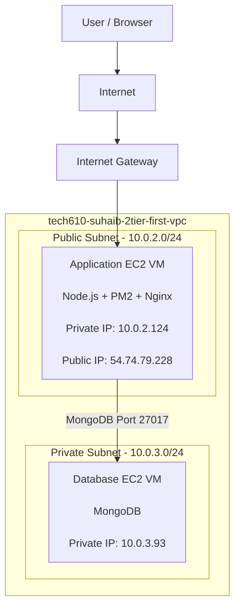

# 🚀 AWS Two-Tier Architecture Deployment with VPC, EC2 and MongoDB

## 📌 Project Overview

This project demonstrates the design and deployment of a secure two-tier architecture on AWS.

The architecture separates the application and database layers by placing:

- Application server in a public subnet
- Database server in a private subnet

The deployment uses:

- AWS VPC
- Public and private subnets
- Internet Gateway
- Route Tables
- Security Groups
- EC2 instances
- Custom AMIs
- Node.js application
- MongoDB database
- Nginx reverse proxy
- PM2 process management

---

# 🏗️ AWS Two-Tier Architecture Diagram

# Step 2 - Create Public and Private Subnets

## Public Application Subnet

Purpose:

- Hosts application EC2 instance
- Allows external user access

Configuration:

- CIDR: `10.0.2.0/24`

Screenshot:

(Add public subnet screenshot)

---

## Private Database Subnet

Purpose:

- Hosts MongoDB database
- Prevents direct internet access

Configuration:

- CIDR: `10.0.3.0/24`

Screenshot:

(Add private subnet screenshot)

---

# Step 3 - Configure Routing

## Internet Gateway

Allows public subnet resources to communicate with the internet.

Screenshot:

(Add Internet Gateway screenshot)

## Route Tables

Public route:
